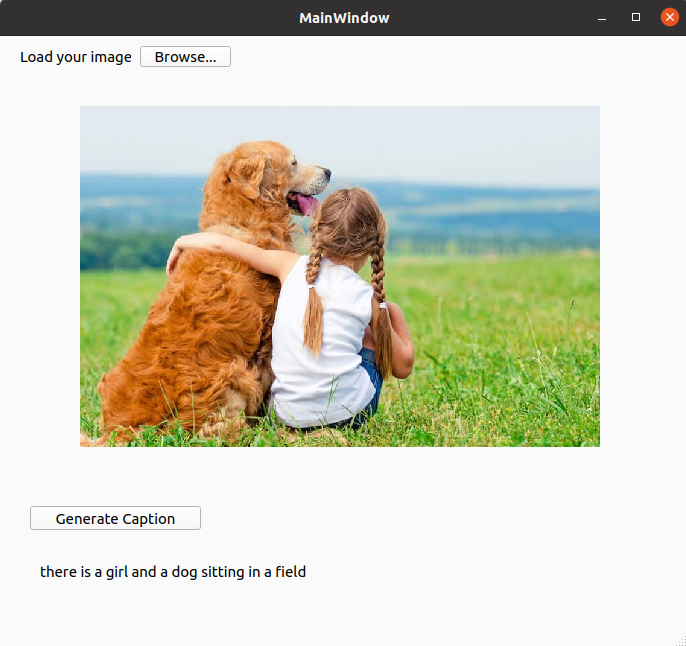

# Image-Captioning-Transformer-QT-C++
This is a simple application that uses an ONNX model for image captioning and a text decoder model to generate captions for images. The application is built using the Qt/C++ framework.



NOTE: First of all convert blip model to onnx from this [Conversion BLIP to ONNX](https://github.com/MNaseerSubhani/Blip-Image-Captioning-Large-ONNX).


## Instructions
### Prerequisites
Make sure you have the following installed on your system:

Qt framework
ONNX Runtime library

#### CMake Configuration
This CMake configuration file is designed for building the Caption_app project, a Qt-based application for image and text captioning. Ensure that you have the required dependencies, including Qt and ONNX Runtime, installed on your system.

* Modify the paths to the ONNX Runtime include directories to match your system's file structure. Update the following lines in the CMakeLists.txt file:
 ```
include_directories(/path/to/onnxruntime/include/onnxruntime)
 ```

* Adjust the path to link against the ONNX Runtime library. Update the following line in the CMakeLists.txt file:
```
# Replace with the correct path to libonnxruntime.so on your system
target_link_libraries(Caption_app PRIVATE /usr/local/lib/libonnxruntime.so)

```


### Setup
* Clone the repository to your local machine:

```
git clone https://github.com/MNaseerSubhani/Transformer-Image-Captioning-Qt.git

```
* Open the project in Qt Creator or your preferred Qt IDE.

* Ensure that the ONNX Runtime library is correctly linked to the project.

### Configuration
Update the following file paths in the mainwindow.cpp file to match the location of your models and tokenizer:


```
// File paths for ONNX models and tokenizer
const char* modelVisionPath = "/path/to/your/vision_model.onnx";
const char* modelTextPath = "/path/to/your/text_decoder_model.onnx";
const char* TokenizerPath = "/path/to/your/vocab.txt";

```

### Building and Running
Build and run the application in your Qt IDE. The application allows you to select an image and generate captions for it.
